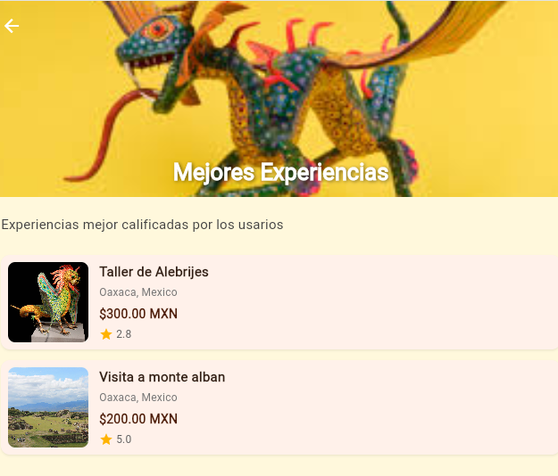
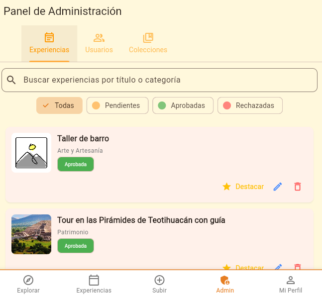

# 🇲🇽 OpenLegado: Experiencias Culturales Mexicanas

**OpenLegado** es la versión base *Open Source* del proyecto LEGADO, una aplicación móvil moderna construida en Flutter que busca conectar a los viajeros con la rica herencia cultural, las tradiciones y los artesanos de México.

## 🌟 Nota del Creador y Licencia Libre

Esta versión, ahora llamada **OpenLegado**, es liberada bajo la **Licencia MIT**, lo que la convierte en **código libre (Open Source)**.

* **Creador Original:** Mario Ramirez, el desarrollador principal y conceptualizador de la idea original

* **Propósito de OpenLegado:** El único objetivo de este repositorio es **mostrar la aplicación funcional** y servir como demostración de la arquitectura y las funcionalidades implementadas. Es una herramienta de aprendizaje y referencia.

* **Licencia MIT:** Al estar bajo la Licencia MIT, este código es libre de usarse, modificarse y distribuirse, incluso con fines comerciales, siempre y cuando se incluya la nota de copyright original. **Esta es una versión libre para la comunidad.**

* **Transición a Teteocan Technologies:** El desarrollo y la dirección comercial de la versión de producción del proyecto LEGADO le pertenece a **Teteocan Technologies**. Estoy ahora desvinculado de las decisiones de desarrollo y en espera de un contrato formal para su comercialización.

**Agradecimiento:** Un especial agradecimiento a todos los **colaboradores** que aportaron su tiempo y talento para llevar esta visión a la realidad. ¡Gracias por su invaluable apoyo\!

-----

## 🎨 Características de la Versión Funcional

Esta versión *Open Source* presenta un núcleo funcional completo:

* **Diseño Híbrido:** Combina la estética cultural mexicana con un diseño de Interfaz de Usuario (UI) y Experiencia de Usuario (UX) modernos.
* **Experiencias Culturales:** Descubrimiento de talleres, gastronomía tradicional y arte local.
* **Flujo de Usuario:** *Onboarding* intuitivo, registro/login y selección de intereses.
* **Navegación Fluida:** Sistema de navegación por pestañas (`Exploración`, `Experiencias`, `Perfil`).
* **Filtros de Categoría:** Filtrado por categorías (Gastronomía, Artesanías, Arte, Música).
* **Vistas Detalladas:** Páginas con información completa, **integración de reseñas** y horarios.
* **Integración de Datos:** Uso de base de datos para `users`, `experiences`, `bookings`, y `reviews`.

-----

## 📸 Vistas de la Aplicación

Para apreciar el diseño y la funcionalidad del proyecto, aquí hay algunas capturas de pantalla clave:

<p align="center">



</p>

-----

## 🔑 Cuenta de Acceso de Administrador (Demo)

Para que los usuarios puedan explorar las funcionalidades de moderación y administración, se proporciona una cuenta demo.

| Rol | Correo Electrónico | Contraseña |
| :--- | :--- | :--- |
| **Administrador (Demo)** | `admin@legado.com` | `legado777` |

⚠️ **Advertencia y Responsabilidad:**
Esta cuenta es para **uso exclusivo de demostración y pruebas funcionales**. Los datos en esta cuenta pueden ser modificados o eliminados en cualquier momento por otros usuarios. **Se ruega a la comunidad que utilice esta cuenta con responsabilidad y no realice cambios maliciosos o destructivos,** ya que el propósito es mantener la integridad de la demostración para todos.

-----

### Últimas Actualizaciones Incluidas

Esta copia contiene las siguientes mejoras clave antes de la transferencia:

* **Refactorización de Código:** Desmenuzado y limpieza del código base.
* **Modelos Estables:** Implementación de modelos sólidos (`Experience`, `Booking`, `User`, `Review`).
* **Gestión de Tickets:** Mejora en el sistema interno de gestión de *tickets*.
* **Buscador Simple:** Funcionalidad básica de búsqueda.
* **Estructuras de Perfil:** Implementación de nuevos componentes para roles de usuario e imágenes en el `Profile`.
* **Base de Datos Centralizada:** Integración inicial de colecciones cruciales en la BD (users, experiences, bookings, review).

-----

## 🛠️ Tecnologías Utilizadas

* **Framework:** **Flutter 3.32.5** (Multiplataforma)
* **Lenguaje:** **Dart 3.8.1**
* **Diseño:** **Material Design** con tema cultural mexicano
* **Integraciones:** Google Maps, HTTP (API Communication), y `Location` (Geolocalización).

## 🗂️ Estructura del Proyecto

```
lib/
├── main.dart                    # Punto de entrada de la aplicación
├── models/                      # Modelos de datos estables
│   └── experience.dart
│   └── user.dart
│   └── booking.dart
│   └── review.dart          
└── screens/                     # Pantallas principales y flujos
    ├── welcome_screen.dart
    ├── login_screen.dart
    ├── register_screen.dart
    ├── interests_screen.dart
    ├── main_navigation.dart
    ├── explore_screen.dart
    ├── experiences_screen.dart
    ├── profile_screen.dart
    └── experience_detail_screen.dart # Con sistema de tickets, visualización y feedback
```

## 🚀 Instalación y Configuración

### Prerrequisitos

* Flutter **3.32.5** o superior
* Dart **3.8.1** o superior
* Java JDK 8 (OpenJDK RedHat configurado)
* Herramientas de Firebase CLI (`npm install -g firebase-tools`)

### Pasos

1.  **Clonar Repositorio:**

    ```bash
    git clone https://github.com/jorgechacon559/legado.git
    cd legado
    ```

2.  **Instalar Dependencias:**

    ```bash
    flutter pub get
    ```

3.  **Configurar Firebase (Si es necesario):**

    ```bash
    firebase login
    dart pub global activate flutterfire_cli
    flutterfire configure
    ```

4.  **Ejecutar:**

    ```bash
    flutter run
    ```

## ⚠️ NOTA IMPORTANTE sobre la Base de Datos

Actualmente, por temas de documentación/pagos de la versión comercial, la base de datos de **Firebase no puede ser actualizada**.

Se adjuntan las **reglas de seguridad de Firebase Storage** que fueron diseñadas para la sección `storage` y que deberían ser aplicadas para garantizar la seguridad de las imágenes de perfil en un entorno de producción:

```code
rules_version = '2';
service firebase.storage {
  match /b/{bucket}/o {
    // Permite la lectura de cualquier archivo para usuarios autenticados
    match /{allPaths=**} {
      allow read: if request.auth != null;
    }

    // Reglas específicas para las imágenes de perfil
    match /profile_images/{userId}/{fileName} {
      // Un usuario solo puede CREAR un archivo en su propia carpeta (userId), con límite de tamaño.
      allow create: if request.auth != null && request.auth.uid == userId
                    && request.resource.size < 5 * 1024 * 1024 // Limite de 5MB
                    && request.resource.contentType.matches('image/.*');
      
      // Permitir borrar archivos si eres el dueño.
      allow delete: if request.auth != null && request.auth.uid == userId;
      
      // Permitir a todos los usuarios leer las imágenes.
      allow read;
    }
  }
}
```

## 📱 Plataformas Soportadas

| Plataforma | Estado |
| :--- | :--- |
| **Windows** | ✅ Nativo |
| **Web** | ✅ PWA |
| **Android** | ✅ Completo |
| **iOS** | 🔄 Configuración inestable |
| **Linux** | 🔄 En espera de soporte de Firebase |

## 💡 Próximas Mejoras (Según Plan Original)

El siguiente trabajo planificado para el proyecto LEGADO incluía:

* **Paneles Administrativos:** Desarrollo de paneles específicos para **Creadores** (artesanos), **Moderadores** (revisión de experiencias) y **Administradores** (control total).
* **CRUD Completo:** Refactorización y restablecimiento del sistema *CRUD* (Crear, Leer, Actualizar, Borrar) de datos.
* **Diseño Final:** Finalización de la decisión de diseño y la implementación de **temas**.
* **QA:** Revisión completa de Calidad y Aseguramiento.
